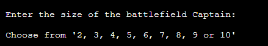

# Star Trek Battleship Game

Developer : Jamie Phelps

[Live Webpage](https://ci-pp3-bs-thephelpster.herokuapp.com/)

# Table of Content

1. [Project Description](#project-description)
2. [Project Goals](#project-goals)
    1. [User Goals](#user-goals)
    2. [Site Owner Goals](#site-owner-goals)
3. [User Experience](#user-experience)
    1. [Target Audience](#target-audience)
    2. [User Requirements and Expectations](#user-requrements-and-expectations)
    3. [User Stories](#user-stories)
4. [Design](#design)
    1. [Design Choices](#design-choices)
5. [Technologies Used](#technologies-used)
    1. [Languages](#languages)
    2. [Frameworks & Tools](#frameworks-&-tools)
6. [Features](#features)
    1. [Existing Features](#existing-features)
    2. [Future Features](#future-features)
7. [Testing](#validation)
    1. [Device testing](#performing-tests-on-various-devices)
    2. [Browser Compatibility](#browser-compatability)
    3. [Testing User Stories](#testing-user-stories)
8. [Bugs](#Bugs)
9. [Deployment](#deployment)
10. [Credits](#credits)
11. [Acknowledgements](#acknowledgements)

# Project Description
This is the classic Battleship game that i have given a Star Trek feel to. Players can play as Starfleet as they try to attack Klingon ships.

# Project Goals
* Play a game of battleships against the computer.
* Use different sized board to change difficulty.
* Learn how to play Battleships.

## User Goals
* To play as many games of Battleships as I want.
* To have a clear game space to see how the board looks.

## Site Owner Goals
* For players to enjoy a game of battleships as many times as they want.
* To leave the player witha good feeling after they've played the game.

# User Experience

## Target Audience
* Battleship game fans.
* Star Trek fans.
* Anyone who wants a fun little game to play.

## User Requirements and Expectations

## User Stories
### First Time User
1. As a first time user, I want to be able to play a game of Battleships.
2. As a first time user, I want to be able to learn the rules of Battleships.
3. As a first time user, I want to see a nice design to the game.

### Returning User
4. As a returning user, I want to be able to change the size of the board for an extra challenge.
5. As a returning user, I want to be able to easily be able to see what move I'm on.

### Website Owner
6. As the game desginer I want people to have a good time playing the game.
7. As the game desginer I want people to be able to restart the game as much as they want.

# Design
## Design Choices
When designing the game I wanted to give they player something a bit nicer to look at than just the code repeated over and over again. This is why i added the logo in and why it appeared consistantly throughout the game.

## Flowchart
The flowchart shows the structure of the program.

# Technologies Used
## Languages
* Python

## Frameworks & Tools
* Git
* GitHub
* GitPod
* PEP8
* Heroku
* Diagrams.net

## Python Libraries
* os - used to clear the terminal.
* random - used to give a random board each play through.
* sys and time - used to add a typing effect to the rules and greeting.

# Features
## Existing Features
### Playable Game
* The most important feature of this battleship game is that its a game that anyone can play and have fun.

User Stories covered: 1, 6

### Logo
* The logo appears at the top of the game everytime you start it.

User stories covered: 3

### Clear Function
* The clear function allows the game to clear the console after everymove keeping the view clear and easy to see where you are in the game.

User stories covered: 5

### Slow Print Function
* the slow print function makes it look like someone is typing out the greeting and rules.

User stories covered: 3

### Greeting
* The greeting welcomes the player to the game and explains whats happening.

User stories covered: 3

### Rules
* The rules explains to the player how the play battleships.

User stories covered: 2

### Board Size Choice
* The board size choice allows the player to choose what size board they'll play the game on.

User stories covered: 3, 4

### In-Game Messages
* The in-game messages give the player feedback on how the game is going what what they need to do next.

User stories covered: 3

### Restart Function
* Last function added to the game was the ablitly to restart the game when finished or to exit the game.

User stories covered: 7

## Future Features
* Score loging system
* A login function

# Validation and Testing
I have put the python code through PEP8 in the workspace where I wrote the code as the pep8online.com website was down.

No issues where flagged up apart from the spacing in the logo that make up the words 'BattleShips'.

To test the game ran as i expected it to, I played through it multiple times both playing as is expected and trying to get it not to work.

## Testing user stories

1. As a first time user, I want to be able to play a game of Battleships.

| **Feature** | **Action** | **Expected Result** | **Actual Result** |
|-------------|------------|---------------------|-------------------|
| Game | play the game | enjoying playing battleships | enjoyed playing battleships |

2. As a first time user, I want to be able to learn the rules of Battleships.

| **Feature** | **Action** | **Expected Result** | **Actual Result** |
|-------------|------------|---------------------|-------------------|
| game rules | see the rules appear | read the rules | learn the rules |

3. As a first time user, I want to see a nice design to the game.

| **Feature** | **Action** | **Expected Result** | **Actual Result** |
|-------------|------------|---------------------|-------------------|
| logo, slowprint, greeting, board size, messages | see all the designs | enjoy the game | enjoyed the game |

4. As a returning user, I want to be able to change the size of the board for an extra challenge.

| **Feature** | **Action** | **Expected Result** | **Actual Result** |
|-------------|------------|---------------------|-------------------|
| board size | change the size of the game board | choose multiple sizes to play on | play on multiple size board |

5. As a returning user, I want to be able to easily be able to see what move I'm on.

| **Feature** | **Action** | **Expected Result** | **Actual Result** |
|-------------|------------|---------------------|-------------------|
| clear function | clear the console automatically | clear the console to see game better | clears console to see game better |

6. As the game desginer I want people to have a good time playing the game.

| **Feature** | **Action** | **Expected Result** | **Actual Result** |
|-------------|------------|---------------------|-------------------|
| play game | play the game | enjoyable gameplay | enjoy playing the game |

7. As the game desginer I want people to be able to restart the game as much as they want.

| **Feature** | **Action** | **Expected Result** | **Actual Result** |
|-------------|------------|---------------------|-------------------|
| restart function | player can restart the game when finished | the game can either exit or restart | the game restarts or exits |

## Bugs
| **Bug** | **Fix** |
| ----------- | ----------- |
| spacing error when played in heroku | added spaces to the front of the print()s |
| board printed Y axis 2x as much as it should | code error where its interated through list twice |
| various run issues | indentation checked and corrected |
| code layout errors | making sure that each def had two spaces above |

### Unfixed bugs
The console doesnt clear the logo when running on heroku, not sure why this is but it clears as it should in the console in GitPod.

# Deployment
## Heroku
This application has been deployed from GitHub to Heroku by following the steps:

1. Create or log in to your account at heroku.com
2. Create a new app, add a unique app name (this project is named "ci-pp3-bs-thephelpster") and choose your region
3. Click on create app
4. Go to "Settings"
5. Under Config Vars store any sensitive data you saved in .json file. Name 'Key' field, copy the .json file and paste it to 'Value' field. Also add a key 'PORT' and value '8000'.
6. Add required buildpacks (further dependencies). For this project, I set up 'Python' and 'node.js' in that order.
7. Go to "Deploy" and select "GitHub" in "Deployment method"
8. To link up our Heroku app to our Github repository code enter your repository name, click 'Search' and then 'Connect' when it shows below
9. Choose the branch you want to buid your app from
10. If prefered, click on "Enable Automatic Deploys", which keeps the app up to date with your GitHub repository
11. Wait for the app to build. Once ready you will see the “App was successfully deployed” message and a 'View' button to take you to your deployed link.

## GitHub
The website was deployed using GitHub Pages by following these steps:
1. In the GitHub repository navigate to the Settings tab
2. On the left hand menu select Pages
3. For the source select Branch: main
4. Once saved, GitHub will refresh and your website will be publishd from GitHub repository

### Forking the GitHub Repository
1. Go to the GitHub repository
2. Click on Fork button in top right corner

### Making a Local Clone
1. Go to the GitHub repository 
2. Locate the Code button above the list of files and click it
3. Highlight the "HTTPS" button to clone with HTTPS and copy the link
4. Open Git Bash
5. Change the current working directory to the one where you want the cloned directory
6. Type git clone and paste the URL from the clipboard ($ git clone https://github.com/YOUR-USERNAME/YOUR-REPOSITORY)
7. Press Enter to create your local clone
# Credits

## Content
All referances to Star Trek came from the TV show.

## Code and Design
* Stack Over Flow - for the slow typing function basics.
https://stackoverflow.com/questions/4099422/printing-slowly-simulate-typing

* Youtube - video for the starting point for my Battleship game.
https://www.youtube.com/watch?v=tF1WRCrd_HQ&t=390s

* Copy Assignment - helped with starting point as well.
https://copyassignment.com/battleship-game-code-in-python/

# Acknowledgements

I'd like to thank these people who gave me all the help and support I needed to finish and make this project look as good as it does.

* Mo Shami, my mentor, for all the guidance, help and keeping me from giving up when the code wasn't working out the way I wanted.

* Kate for being my rock when I was struggling to keep going with the course and keeping me sane.